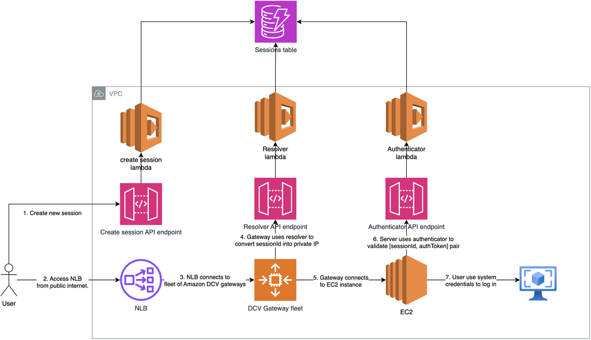

# Sample: Amazon DCV Gateway with serverless API 

A CDK-based sample for deploying Amazon DCV Gateway with auto-scaling capabilities and serverless API for instance resolution and sample traffic authorization.



## Overview

This project implements:
- Auto-scaling group for Amazon DCV Gateway
- Serverless API for instance management (for demonstration purposes only)
- Sample session-based authorization system (for demonstration purposes only)
- DynamoDB-based session tracking (for demonstration purposes only)

## Prerequisites

- AWS CDK installed
- AWS CLI configured with appropriate credentials
- Python3 installed

## Installation

1. Clone the repository
2. Create a `cdk.context.json` file with the following configuration: 
```json
{
  "account": "required: required to search for AMIs",
  "region": "required: required to search for AMIs",
  "gateway:allowed-ip-cidr": "required: allowlisted IP range or 0.0.0.0/0 for public access",
  "gateway:session-lifetime": "optional, 3600 as default: by default session should be established in 1h or will expire",
  "gateway:min-capacity": "optional, 1 as default: min number of EC2 instances in gateway fleet",
  "gateway:max-capacity": "optional, 2 as default: max number of EC2 instances in gateway fleet"
}
```
3. Install dependencies:
```bash
python3 -m venv .venv
source .venv/bin/activate
pip install -r requirements.txt
pip install -r requirements-dev.txt
```

4. Deploy the stack:
```bash
cdk deploy
```

## Usage

### Creating a New Session

1. Locate your target instance ID from EC2 console (instances are tagged with `dcv:` prefix)
2. Use the API Gateway endpoint:
- API: DcvAccessManagementApi
- Endpoint: POST /session
- Query Parameter: instanceId={your-instance-id}
3. Connecting to DCV
Use the following URL format to connect:
```
https://{NLB_DNS}:8443?authToken={TOKEN}#{SESSION_ID}
```
Where:
- NLB_DNS is your Network Load Balancer DNS name
- TOKEN is the authentication token received from the API
- SESSION_ID is your session identifier received from the API

## Architecture
- Auto Scaling Group : Manages DCV Gateway instances
- API Gateway : Handles session management and authorization
- DynamoDB : Stores session information
- Lambda Functions : Process session requests and authorization


## Security Considerations
- Session tokens are valid for 1 hour (configurable via CDK context)
- Access is restricted based on configured IP CIDR
- Each session can only be activated once
- Secret-based authorization is for demonstrating purposes only
- EC2 instances configuration serves only integration purposes and should be hardened
- gateway and server instances should use private CA to ensure communication secured with private certificates

## Limitations
This implementation is intended as a starting point and should be enhanced with:
- Additional security measures
- Proper access management
- Production-grade monitoring and logging
- narrowed-down access to KMS

## Important Notes
This repository should be used only as a foundation for implementing proper access management and is not considered production-ready in its current state.

## Contributing
Contributions are welcome! Please feel free to submit pull requests.

## License
MIT-0